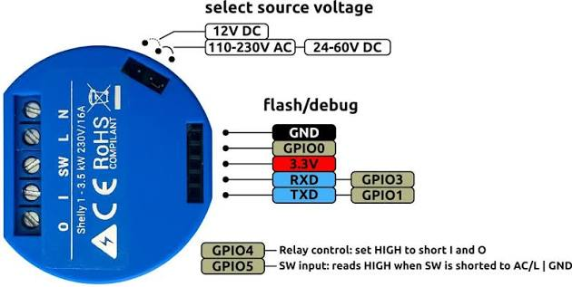

[Amazon Link](https://www.amazon.com/dp/B07G33LNDY)

## GPIO Pinout

| Pin   | Function          |
| ----- | ----------------- |
| GPIO4 | Relay             |
| GPIO5 | Switch Input      |
| GPIO0 | Bootstrapping Pin |
| GPIO1 | Tx (Serial UART0) |
| GPIO3 | Rx (Serial UART0) |



## Basic Configuration

> [!TIP]
> Don't forget to add top level keys like `api:`, `ota:`, etc. to your configuration.

```yaml file=config.yaml
```

## Detached switch mode for push button light switch

This config will send events to Home Assistant so you can use the Shelly as detached switch. The events can be used as
triggers for automations to toggle an attached (smart) light, and to perform other actions on double click and long
click (e.g. turn off all the lights on the floor, start a "go to bed" automation).

In case there is no connection to Wifi, or no API connection (normally Home Assistant) the config will toggle the relay,
so it will still toggle the attached light in cases where Wifi or HA fails.

The relay is exposed to Home Assistant as a switch. As well as some (optional) sensors with information on the ESPHome
version and Wifi status

```yaml file=config_detached-momentary-switch.yaml
```

## Detached switch mode for toggle light switch

This config will send events to Home Assistant so you can use the Shelly as detached switch. The events can be used as
triggers for automations to toggle an attached smart light.

In case the relay is switched off, the Shelly has no connection to Wifi, or no API connection to Home Assistant can be
made, the config will toggle the relay. This allows the switch to still keep turning the attached smart light on and off
when WiFi or Home Assistant is unavailable.

When the power drops and goes back on, the relay will default to off. This prevents lights turning on when a short power
outage happens when you are away from home.

The relay is exposed to Home Assistant as a switch. As well as some (optional) sensors with information on the ESPHome
version and Wifi status

```yaml file=config_detached-toggle-switch.yaml
```

## Example as a Garage Door opener (via Dry Contact)

```yaml file=config_garage-door-motor.yaml
```

## Using Additional GPIO Pins

When on DC power, the three pins of the programming header are available to use as additional GPIO.

**Note:** The output voltage of these pins is 3.3V max, not the full DC supply voltage.

> [!CAUTION]
> When powered by AC line voltage, GPIO pins are referenced to AC(L).
> **DO NOT** Attempt to use the programming header as GPIO pins unless the Shelly 1 is powered by DC.

> [!IMPORTANT]
> GPIO0 is a bootstrapping pin. The pin must not be pulled low during boot.
> It is safe to use as an output. Use as an input only if you know for sure it will never be low during boot.

```yaml file=config_additional-gpio-pins.yaml
```

## Links

* [AS/NZS 4417 Certificate of Suitability](https://smartcentralsolutions.com.au/wp-content/uploads/2020/10/Shelly_1_AS_NZS_Certificate_Suitability.pdf)
